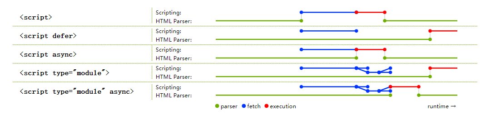

# 异步加载脚本, defer 与 async的区别




## html文件中<script>标签的位置
通常在html文件中，script标签可以放在head标签和body标签中，可以通过script标签的src引入外部js文件，也可以直接在script标签中写js代码
但是通常我们将script标签放在body标签内部的最后，因为如果将script标签放在head标签内，那么下载，解析，执行js代码的时候页面的渲染会被阻塞，只有当js文件全都被下载，解析，执行完后，页面才会开始渲染，所以通常将script标签放在body标签内部的最后

```html
<html>
    <head>
        <script src="js文件路径"></script>
        <script>
            function test() {
                alert("hello world");
            }
        </script>
    </head>
    <body>
        <div>
            test
        </div>
        <!-- 其他html标签 -->
        <!-- 放在body的最后面 -->
        <script src="js文件路径"></script>
        <script>
            function test() {
                alert("hello world");
            }
        </script>
    </body>
</html>
```
## html文件加载脚本的过程
在`<script></scrip>`标签不加任何的修饰符的情况下, 脚本加载的情况：
    1. 脚本加载分为三个阶段， **加载， 解析， 执行**，在通常情况下这三个阶段都会阻塞DOM渲染，因此一般都放到最后进行
    2. 加载对应的就是图中的fetch， 解析和执行脚本就对应图中的execution

通过使用 defer 和 async 可以实现脚本的异步加载，从而提高效率

## defer 和 async 的相同点和不同点
**相同点**： defer 和 async 都能实现脚本的异步加载， 异步加载的含义就是 脚本的加载不会影响html文件的DOM解析，也就是说加载脚本的过程不会使得DOM渲染无法进行， 从而提高DOM渲染的效率
**不同点**： 虽然defer 和 async 都能异步加载脚本，但对于脚本加载完成后，脚本的执行时间defer 和 async 有不同的选择。async会在脚本加载完成之后就开始执行，而不管DOM渲染是否完成，从而会阻塞DOM渲染. 而 defer 是将脚本的执行放到了DOM渲染完成之后， DOMContentLoad事件之前， 因此 defer是不会导致DOM渲染被阻塞

## 代码表示
```html
<html>
    <body>
        <script type="text/javascript" src="./defer.js" defer></scrip>
        <script type="text/javascript" src="./async.js" async></script>
        <script>
            console.log('start')
            document.addEventListener('DOMContentLoaded', function(e) => {
                console.log('DLC')
            })
        </script>
    </body>
</html>
```

```javascript
// defer.js
console.log('defer');
```

```javascript
// async.js
console.log('async')
```

总的来说 async 和 defer 都是异步加载js脚本文件， 从而使得加载js脚本文件时不会导致DOM渲染的阻塞，但对于js脚本的执行时间，
async 和 defer 有不同的选择  async 会选择在脚本加载完成之后立马开始执行脚本，
而defer会选择在 DOM渲染完成之后， DOMContentLoad时间开始之前进行

#Reference
[Docs](https://html.spec.whatwg.org/multipage/scripting.html#the-script-element)
