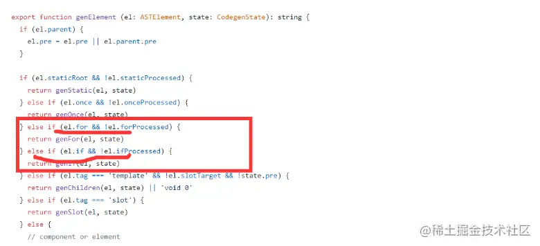
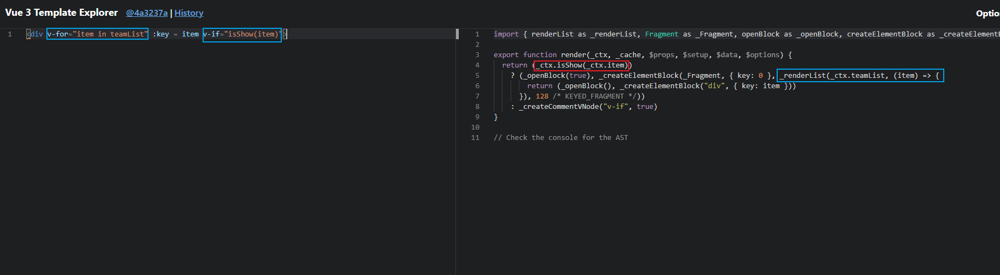

## v-if 与 v-for的优先级
根据官方文档 
在 2.x版本中 如果v-for和 v-if作用于同一个元素上，那么v-for的优先级高于v-if。也就是说会先进行循环，在进行判断这个节点是否能够展示出来
v-for比v-if的优先级的原因在于，在源码中，会先判断是否有v-for, 如果有v-for那么会先有一个循环函数，
之后再去判断是否有v-if， 如果有v-if的话，那么再会有一个判断函数，去判断是否渲染这个节点
源码截图：

而在3.x版本中, 当在同一个节点上应用v-if和v-for时，v-if的优先级高于v-for，
会先进行判断，判断为true时，才会进行v-for循环
生成的render函数截图

### 官方建议
最好不要把v-if 和 v-for 同时应用到一个元素上
可以先将v-if提取出来判断是否渲染，然后载通过v-for进行循环渲染

### Reference
[docs](https://juejin.cn/post/6993745776107061284)

